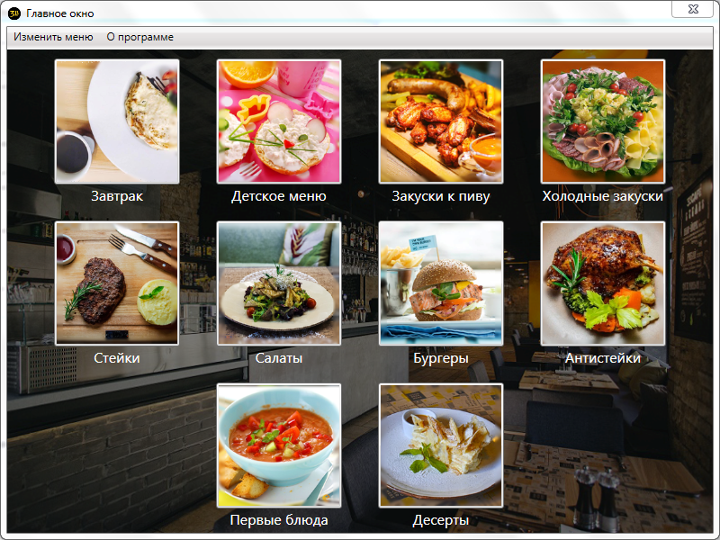
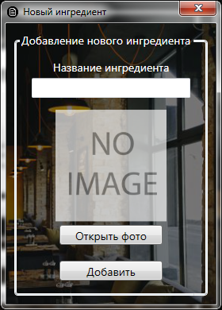
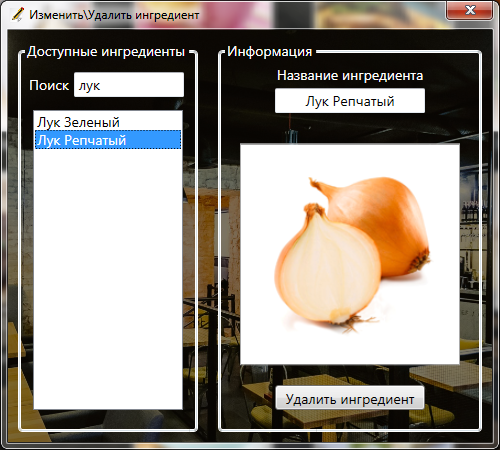
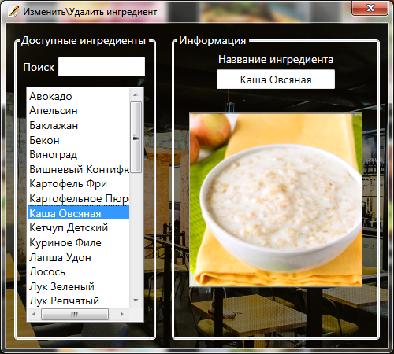
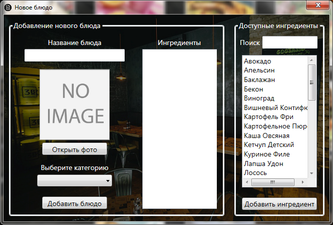
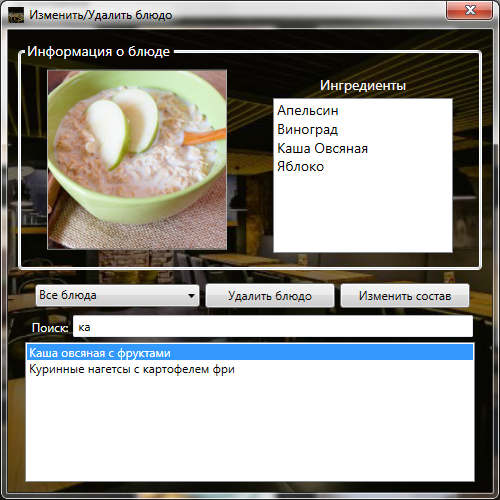
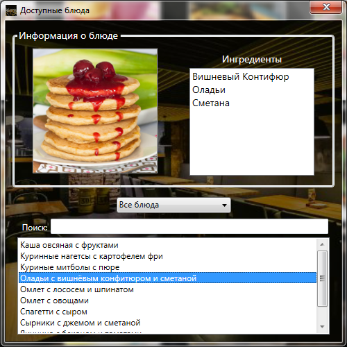
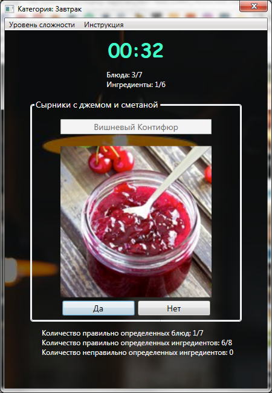

# MENU #

I implemented program, which must help new waiter to learn menu restaurant where they are will work.

### I used ###

* C# WPF
* PostgreSQL
* Microsoft Visual Studio

### Features ###

* Add new ingredient/dish (wish photo, if you want)
* Delete ingredient/dish
* Show add ingredient/dish (include show all dish in current category, like a breakfast, etc.)
* Find ingredient/dish in window, where you can see all avaliable data

### How can I improve the program ###

* Firstly, it's create global DB, because now, I'm used local DB and if I want sent my program I encounter database transmission problems
* Add new features, like a statistics, edit dish/ingredient
* Create more beautiful interface (Front End)

### About program ###

* Main Window

* Ingredient

*	Add

*	Delete

*	Show

* Dish

*	Add

*	Delete

*	Show

* Testing Window

